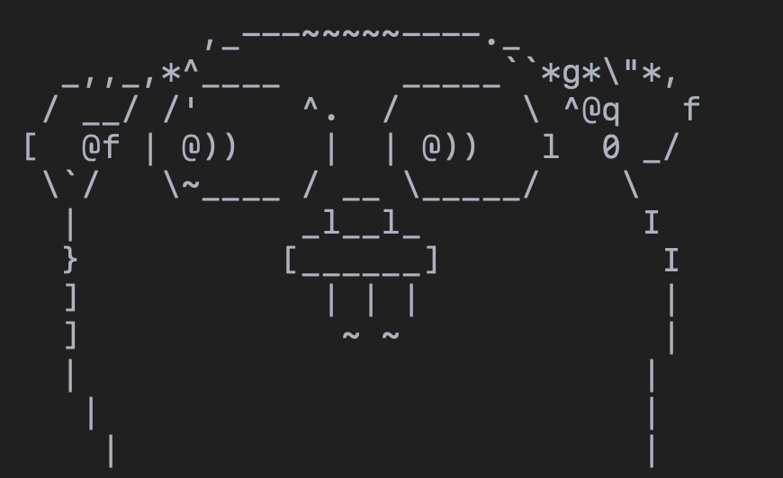
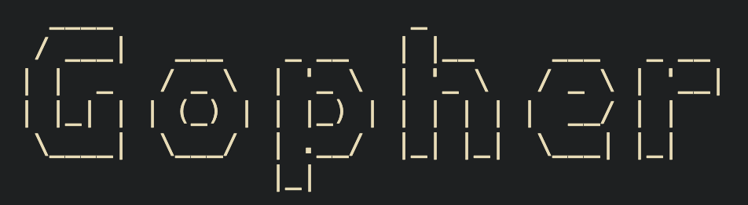

# GO-ascii-art

A small practice project for generating ASCII art in Go.


## Preview

Here’s what the ASCII output looks like when you run it:


## Gopher Art





## Run Locally

Clone the repo and install dependencies:

```bash
git clone https://github.com/Giorno-Giovanna-Dio/GO-asscii-art.git
cd GO-asscii-art
go mod tidy
```
then run :
```bash
go run main.go --text="Hello Gopher!" --font="slant"
```


## Features
- Generate ASCII art with multiple figlet fonts
- Supports flags like --text and --font
- Built using figlet4go
- 100% Go, no dependencies outside the standard toolchain


## License
MIT License © 2025 David Chung